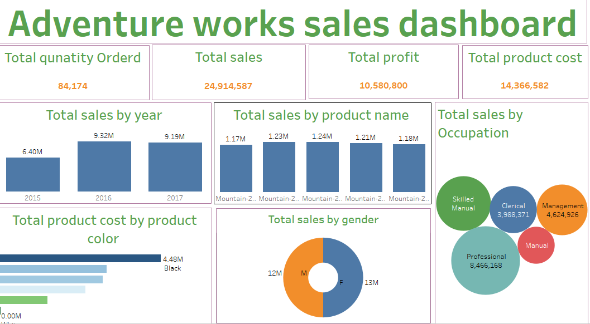

### Adventureworks_project6

### INTRODUCTION

This report delivers data-driven insights to drive business growth, focusing on sales, customer, and product analytics. Key findings and recommendations enable informed decision-making, operational improvements, enhanced customer experiences, and effective market strategies.. Tableau  is use for Analysis 

## Problem Statement 

The Objectives of this analysis is to calculate.

- Total Quantity Ordered: 84,174
  
- Total Sales: 24,914,587
  
- Total Profit: 10,580,800
  
- Total Product Cost: 14,366,582

 ## Skills Demostrated

  The following skills are demostrated

  - Excel for data profiling
    
  - Tableau  for data visualization

    ## Data Analysis and Visualization 

- Total Quantity: 84,174
  
- Total Sales: 24.9M
  
- Total Profit: 10.5M
  
- Top Year: 2017 (9.19M)
  
- Top Gender: Female
  
- Top Occupation: Professional (8.46M)
  
- Top Color: Black (4.48M)
 
